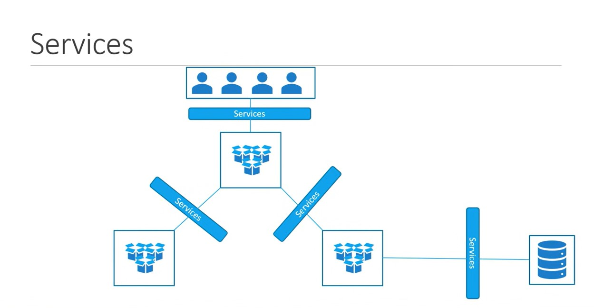
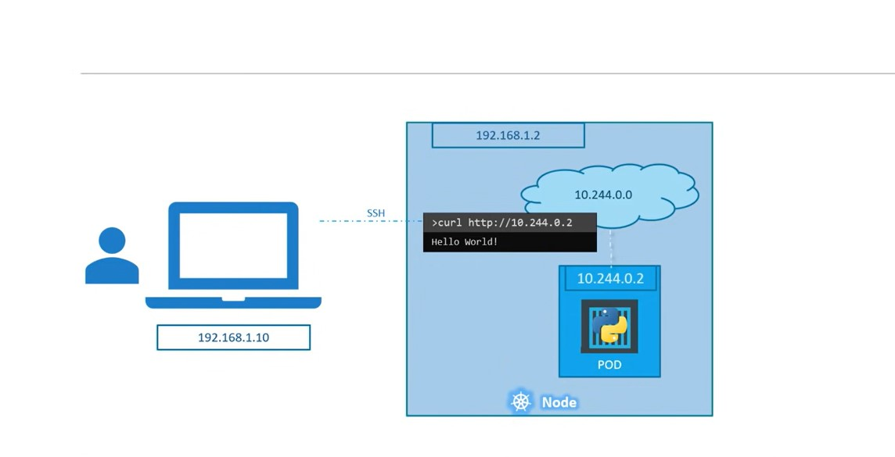
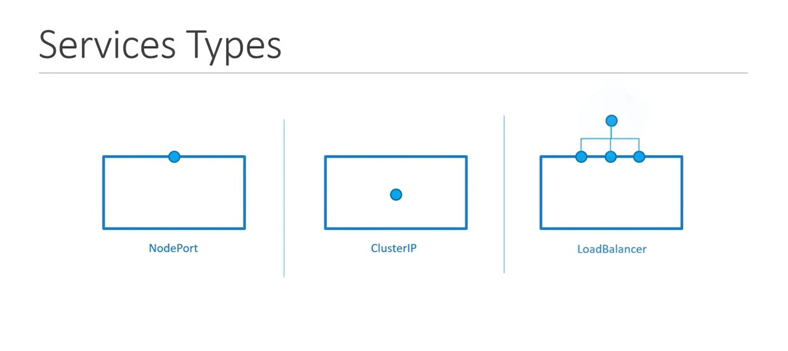
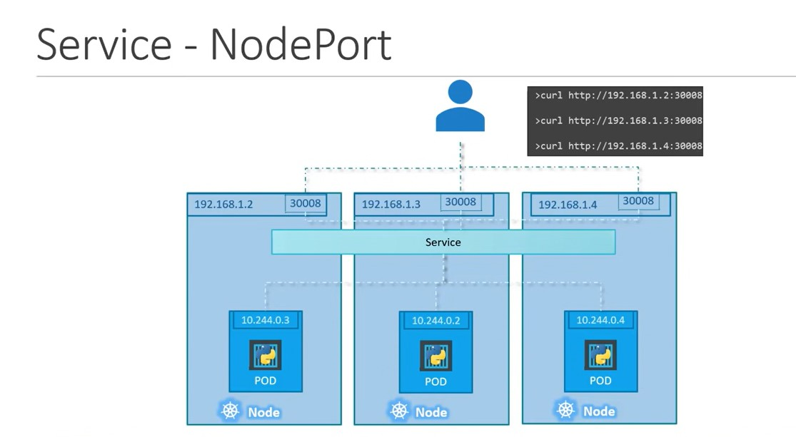

Credits - Kodekloud

### Services



- Each pod have it's own IP address in k8s
- Pods are ephemeral means they destroy frequently and the problem with this is that you need to manually adjust the new IP everytime a new pod restarts.
- We cannot access the kubernetes resources directly because that is in a different network. e.g. consider running a nginx webserver 
- If we need to to access the webserver then we need to SSH into the node system and then use curl or fire up a browser. 


- To access it from any other device we need services that will forward request to our pod. 


- Three types of services are there
	- NodePort
	- ClusterIP
	- LoadBalancer

#### Nodeport
- In the image below, the port on the pod where the actual nginx webserver is running is called TargetPort
- The second is the port on the service in this is simply called port
- Inside a cluster a service have it's own IP address and that IP address is called cluster IP. 
- port on the Node is called the NodePort
- NodePort can only be in the range of 30000-32767


#### Creating a service
- As we have done in the past, we will write a YAML file for our service. 
```
apiVersion: v1
kind: Service
metadata:
	name: my-service
spec:
	type: NodePort
	ports:
		- targetPort: 80
		  port: 80
		  nodePort: 30008
```

- We will use labels and selectors to match services to our pods. This is the technique that we will see very frequently in kubernetes. 


- When you have multiple pod of same kind running in the same node 
- In the service we define selector with `app: myapp`
- In the pod we define labels with `app: myapp`
- Service then forwards the request coming from the external users to these pods with the label myapp. 
- It acts a built in load balancer. 


- When you have multiple pod of same kind but running in different nodes
- Kubernetes automatically creates a service that spans across the nodes in the cluster.


- Services give you a stable IP address
- For services to identify the pods we use labels and selectors as we do in other kubernetes objects. 
