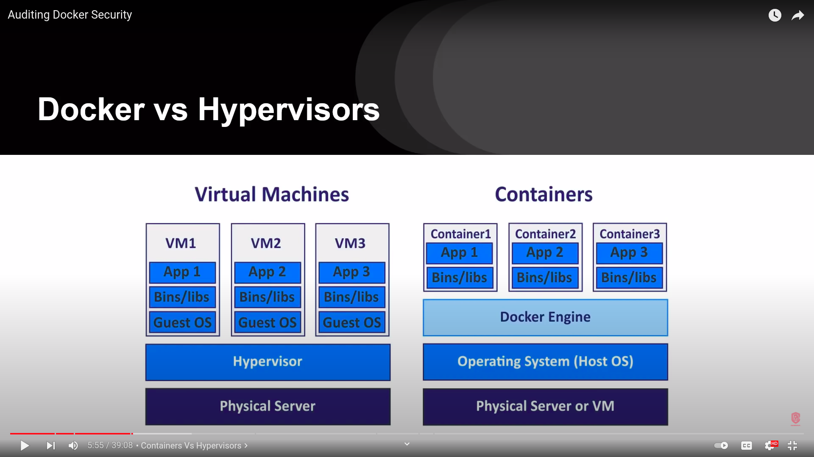
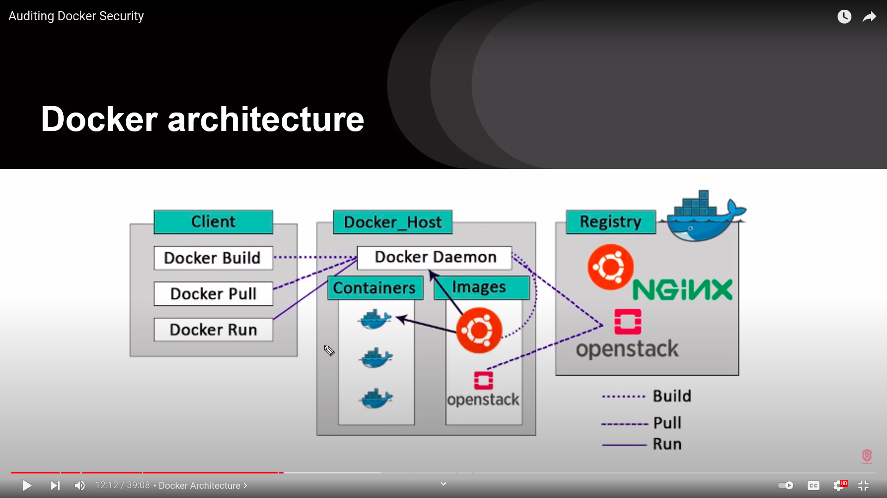

# Auditing Docker security

**Main highlights**

- overview of the docker platform
- common security issues and pitfalls
- docker registries and hashes
- docker security benchmark and cve's
- auditing the docker platform

## auditing docker security

- in order to fully grasp the process of securing docker as a platform, we need to contextualize the functionality and structure of the platform in order to understand when the security pitfalls exists.
- after we have an understanding of how the platform works and where the security issues exist, we can begin exploring the process of performing a security audit in order to establish a baseline that we can use to guide us during the process.

## what is the docker platform?

- docker is pass (platform as a service) containerization technology that utilizes os-level vitualization that allows users to package, ditribute and deploy software, web apps and any other type of data that can be containerized.
- docker distinguishes itself from classic level 2 hypervisors by utilizing the host os kernel as opposed to virtualizing an operating system for each container.

## docker vs hypervisors



## docker architecture



- user interact with docker client which will be sent to docker daemon
- docker daemon can be remote or local, interaction between docker host and docker client, which is done with the help of api
- communication is facilitated through tcp socker if it remote or domain socket if it is local.
- at first docker daemon will look image in local registry

### what is containerd?


when you are building a large platform or distributed system you want an abstraction layer between your management code and the syscalls and duct tape of features to run a container. that is where containerd lives.  
containerd was designed to be used by docker and kubernetes as well as any other container platform that wants to abstract away syscalls or os specific functionality.  
another area that has been added to containerd over the past few months is a complete storage and distributed system that supports both oci and docker image formats.  
you get push and pull functionality as well as image management, you get containers and their tasks. an entire api dedicated to snapshot management, basically everything that you need to build a container platform without having to deal with the underlying os details.

### docker namespace and cgroups

namespaces are one of a feature in the linux kernel and fundamental aspect of containers on linux. on the other hand, namespace provide a layer of isolation. docker uses namespaces of various kinds to provide the isolation that containers need in order to remain portable and refrain from affecting the remainder of the host systems. each aspect of a container runs in a separate namespace and its access is limited to that namespace.

namespace types:

- proces id
- mount
- ipc (interprocess communication)
- user (currently experimental support for)
- network

the most effective way to prevent privilege-escalation attacks from within a container is to configure your containers applications to run as unprivileged users. for containers whose processes must run as the root user within the container, you can re-map this user to a less-privileged user on the docker host.  
when we run docker with root use that easy to install packages and manage containers, unfortunately the issue is within docker container users can access the underline host machine as below that's a big risk

```
<!-- run a container and mount host /etc onto /root/etc -->
docker run --rm -v /etc:/root/etc -it ubuntu

<!-- make some changes on /root/etc/hosts -->
/# vi /root/etc/hosts

<!-- exit from the container -->
exit

<!-- check /etc/hosts and try to delete it -->
cat /etc/hosts
rm /etc/hosts
```

### enabling user namespace

mainly namespace remapping manages two files:

1. /etc/subuid
1. /etc/eubgid

```
<!-- create a user called "dockermap" -->
sudo adduser dockermapper

<!-- setup subuid and subgid -->
sudo sh -c 'echo dockermap:40000:65536 > /etc/subuid'
sudo sh -c 'echo dockermap:40000:65536 > /etc/subgid'

vim /etc/docker/daemon.json

{
  "userns-remap": "dockermap"
}
```

and restart docker

`sudo /etc/init.d/docker restart`

then you could see new docker containers couldn't have permission to host machine /etc/

```
<!-- Run a container and mount host1's /etc onto /root/etc  -->
docker run --rm -v /etc:/root/etc -it ubuntu

<!-- try to delete host machine files -->
rm /root/etc/hosts
rm: cannot remove 'hosts': permission denied
```

### common control groups

cgroups provide resource limitation and reporting capability within the container space. they allow granular control over what host resources are allocated to the containers and when they are allocated.

1. cpu
1. memory
1. network bandwidth
1. disk
1. priority

using these cgorup policies is very simple. if you for instance want to lock down a docker container to the first cpu core, you'd append `--cpuset-cpus=0` to your `docker run` command. and also you could setup the cpu shares which you required.

`docker run -d --name='kasun_priority_1' --cpuset-cpus=0 --cpu-shares=20 kasuntest1

in summary namespace gives the isolation for the container with the underline host where cgroup gives the ability to allocate things to those containers

### docker registry

the registry is a stateless, highly scalable server side application that stores and lets you distribute docker images. the registry is open-source, under the permissive apache license.

**why use it**

- tightly control where your images are being stored
- fully own your images distribution pipeline
- integrate image storage and ditribution tightly into your in-house development workflow.
